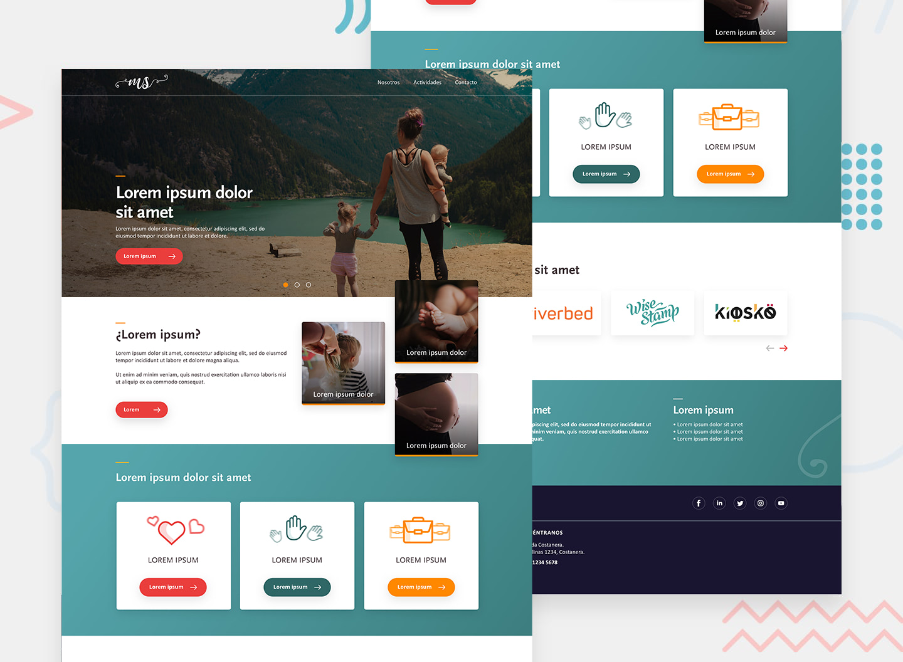

# 🖖 Prueba técnica frontend - Ilógica
 



This is a [Next.js](https://nextjs.org/) project bootstrapped with [`create-next-app`](https://github.com/vercel/next.js/tree/canary/packages/create-next-app).

Prueba técnica para Ilógica, basada en la creación de un sitio web con una librería frontend o framework JS, como React, Vue, Angular.

## Instalación

Este proyecto ha sido desarrollado Next.js, por lo que primero deberás instalar las dependencias correspondientes.

```
git clone git@github.com:donCelis/weighapp-react.git
cd website-ms
npm i
```

## Uso

### -Inicio del servidor

```bash
npm run dev
```

Puedes ver el sitio web en el siguiente enlace: `localhost:3000`.

### -Empaquetado de aplicación

```bash
npm run build
```

Si necesitas saber los demás comando de npm puedes consultar el archivo: `package.json`


## Info del proyecto

Este proyecto ha sido servido con datos de ejemplo desde:

1. El archivo `data.js` alojado en la carpeta raíz del proyecto
2. Una fake api. [mockapi.io](https://mockapi.io/)
3. Los estilos fueron creados con sass


## License

This project is open source and available under the [MIT License](LICENSE).
___
 
Copyright © 2020 - present [Alexander Celis](https://gitlab.com/dacelis0) 🇨🇴